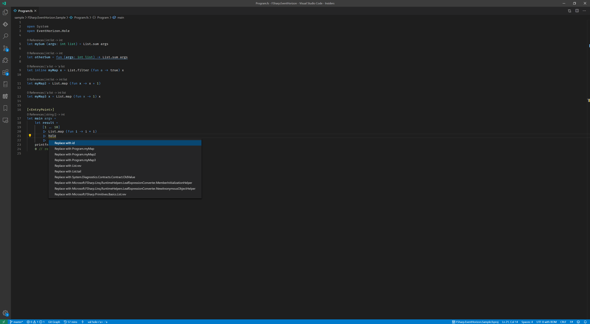
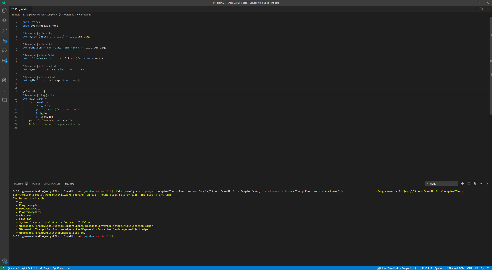

# FSharp.EventHorizon

An **experiment** attempting to implement `type holes` and `type-directed search`/`valid hole fits` using F# analyzers. Long story short, it's an attempt of suggesting replacement for the unkown functions using type inferences and finding other entities that have fitting type signature.

- Read more about `type holes`: https://downloads.haskell.org/~ghc/7.10.1/docs/html/users_guide/typed-holes.html
- Read more about `type-directed search` in PureScript: https://github.com/paf31/24-days-of-purescript-2016/blob/master/23.markdown
- Read more about `valid hole fits` in GHC: https://mpg.is/papers/gissurarson2018suggesting.pdf

Unlike some of the solutions for other FP languages this is not feature implemented directly in compiler, nor is feature of particular IDE, but it's using F# Analyzers.

Read more about F# Analyzers:
  - Intro blog post - https://medium.com/lambda-factory/introducing-f-analyzers-772487889429
  - FSharp.Analyzers.SDK repo - https://github.com/ionide/FSharp.Analyzers.SDK
  - Sample analyzer implementation - https://github.com/Krzysztof-Cieslak/FSharp.Analyzers.Sample
  - Sample repo showing how to use analyzers - https://github.com/Krzysztof-Cieslak/AnalyzersShowcase

## Limitations

F# Compiler Service is not exposing any API for `subsumption of types`. I've implemented really naive algorithm to check if entity can fit given type hole... but well, it's definitely not following 100% rules of the F# compiler, so not every suggestion is found.

I think that this limitation is acceptable given that the project is in experiment phase - if it were productized, we would need to expose those missing APIs from F# Compiler Services, so investing more into custom algorithm here would be waste of time

## How to build

1. Install requirements - .Net SDK 3.0, and Paket global tool
2. Clone the repo
3. `dotnet build`

## How to play with it

First of all build repository.

**In editor** - just open this repository in VSCode with Ionide installed (4.4.2 required). Go to sample project, and open `Program.fs` file. The call of `hole` functions should be marked as warning and there should be a lightbulb quick action suggesting different possible replacements

**From command line** - install latest version of `fsharp-analyzers` CLI tool (0.2.0). From the root of repository run following command - `fsharp-analyzers --project sample/FSharp.EventHorizon.Sample/FSharp.EventHorizon.Sample.fsproj --analyzers-path src/FSharp.EventHorizon.Analyzer/bin`

## How to contribute

*Imposter syndrome disclaimer*: I want your help. No really, I do.

There might be a little voice inside that tells you you're not ready; that you need to do one more tutorial, or learn another framework, or write a few more blog posts before you can help me with this project.

I assure you, that's not the case.

This project has some clear Contribution Guidelines and expectations that you can [read here](https://github.com/Ionide/FSharp.EventHorizon/blob/master/CONTRIBUTING.md).

The contribution guidelines outline the process that you'll need to follow to get a patch merged. By making expectations and process explicit, I hope it will make it easier for you to contribute.

And you don't just have to write code. You can help out by writing documentation, tests, or even by giving feedback about this work. (And yes, that includes giving feedback about the contribution guidelines.)

Thank you for contributing!

## Contributing and copyright

The project is hosted on [GitHub](https://github.com/Ionide/FSharp.EventHorizon) where you can [report issues](https://github.com/Ionide/FSharp.EventHorizon/issues), fork
the project and submit pull requests.

The library is available under [MIT license](https://github.com/Ionide/FSharp.EventHorizon/blob/master/LICENSE.md), which allows modification and redistribution for both commercial and non-commercial purposes.

Please note that this project is released with a [Contributor Code of Conduct](CODE_OF_CONDUCT.md). By participating in this project you agree to abide by its terms.